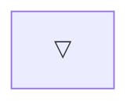
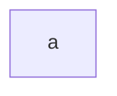
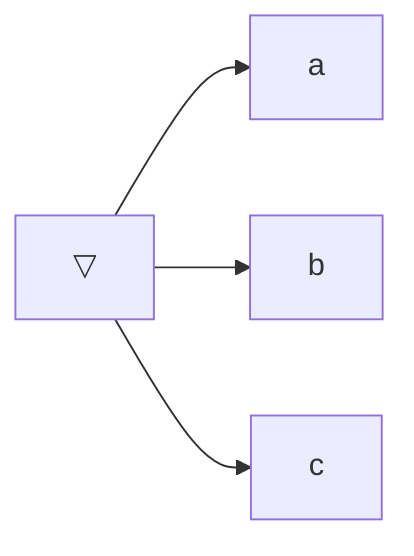
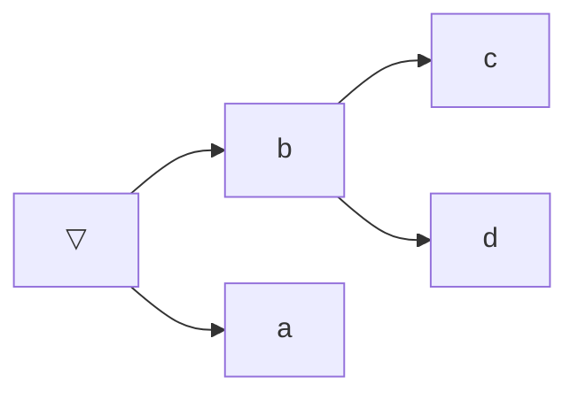

Expressions are structures that relate values together. If names are words, expressions use words to form phrases.

Structure, in expressions, come from a valid filling of one of these two templates:

1. $N$ — A name, on its own.
2. $E_f(E_1, E_2, ..., E_n)$ — An application, where $E_f$ and $E_1...E_n$ (the parameters) are valid expressions themselves.

Here are a few examples of valid expressions:
1. $▽$
2. $a$
3. $▽(a, b, c)$
4. $▽(b(c, d), a)$

And here is a diagram of each one's "structure."

Expressions, like lexical bindings, have values — that value is determined from the expression's structure.

> [!TIP] Evaluation (noun)
> The act of inquiring about the value of an expression.

An expression composed of a single name has the same value as that name (whether it's bound or not).

So the value of the expression $a$ is the value $a$.

An expression composed of an application, though, has a value that follows a table. Let's consider a new value:
$$I$$

We can define an evaluation table for $Id$ that relates groups of parameters to values.

| Parameters | Evaluation |
| ---------- | ---------- |
| $(▽)$      | $▽$        |
| $(▲)$      | $▲$        |

With this table, I can ask you to evaluate the following expression:

$$Id(▲)$$
The resulting value is ||obviously $▲$, duh...||

Alright, we're having fun. With a new value: $\lnot$, and the table:

| Parameters | Evaluation |
| ---------- | ---------- |
| $(▽)$      | $▲$        |
| $(▲)$      | $▽$        |

You should be able to evaluate this expression:
$$\lnot(▽)$$
You should _not_ be able to evaluate this expression, though:
$$\lnot(a)$$
That is because there is no row in our table that tells us how to handle this case. This fine — the expression simply becomes unbounded: just like a variable, it's perceived as not having a defined value, or being able to have any value.

Here's the last example for this chapter. Considering a value $\land$ and the table:

| Parameters | Evaluation |
| ---------- | ---------- |
| $(▽, ▽)$   | $▽$        |
| $(▽, ▲)$   | $▽$        |
| $(▲, ▽)$   | $▽$        |
| $(▲, ▲)$   | $▲$        |

Can you evaluate this expression?
$$\land(\lnot(▽), ▲)$$
Alright, okay, this is a special case. The table for $\land$ in question doesn't contain an answer for this pair of parameters $(\lnot(▽), ▲)$, right?

But this expression does have a value — it evaluates to ▲. That is because the evaluation tables, which correlates parameters to expressions, don't care about _structure_: they care about values. The value of the first parameter $\lnot(▽)$ is $▲$... and thus the biggest expression is equivalent to the last row.

At this point your head will probably be spinning a little bit. "Am I supposed to keep in mind what expressions evaluate to what??? What about big complex expressions???"

In the next chapter, I'll show you how you can perform evaluation in discrete, manageable steps.