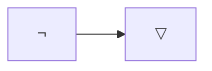
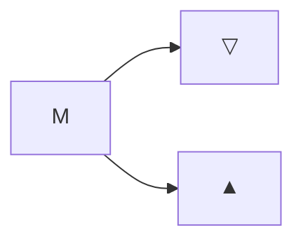
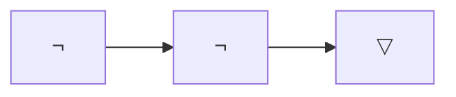

Greetings!

I have always loved mathematics since I was a little boy. It was, perhaps, in part for being autistic and being alone in a chaotic world that I found solace in the consistent and rigorous. Which is why I find weird that there are people who see mathematics as some kind of arcane practice, that could only be understood by few. Looking back it makes sense: I personally did not learn math _from school_ at all, and my classmates either "just got it" or never got it and gave up. I find this very sad.

In this series, we will approach mathematics from the very beginning. The series' purpose is not to enrol you in university, or to give you any useful knowledge, really, but to explain what mathematics _really_ is in ways that school does not teach you and just expects you to understand. While the series aims to be approachable, it will not shy away from using "complicated-looking" symbols and technical language... but I explain every last one of them. My hope is that the more you learn the more you will feel comfortable around big words. They are just words!!!

Oh, and, I _do_ mean the _very beginning._ Forget fractions, forget numbers, forget everything. We will start from a blank page, introduce foundational concepts and only move on when all you are expected to know following that chapter has been said. This means the first few concepts we go over will be _ridiculously_ simple and hilariously self-evident-- but do not get too cocky, we will eventually get to the mind-bending material.

> [!INFO] For the maths nerds...
> I will be using "non-canon" nomenclature throughout the whole series. At points I might feel like you recognise something (and you probably do), but you will not see me using words like "fractions" and "complex numbers."
> 
> If you do feel like something I wrote is _unsound_, however, please correct me at [mrhenribraga@gmail.com](mailto:mrhenribraga@gmail.com).

Now, to our first concept.
### Values
Values are the first important fundamental _thing_ in mathematics. Explaining what a value is is quite tricky, and not because it is complicated!

You see, a value merely _is_. There is nothing else to it. A value does not inherently _do anything_, really.

And that is it! You have learned what a value is!

By now you should know what I really mean by "from the very beginning." You should also be rather unsatisfied since there are no moving parts to play with.

While values as an idea does not give us any interesting toys, they do play a central role in mathematics. Now, for the purpose of demonstration, I will create our first value for us to explore.

So... there we go. I made a new value.

...

Hmm...
### Lexical Bindings
Alright, so, I can not just "give" you the value I thought of, not in any meaningful way. That is because a value is, at its core, an idea one can think of, and ideas can not be directly shared. If I ask you "think of an animal," and I ask you to tell me which one you thought of, you will use _language_ to elicit the idea you thought of to me. "Elephant."

To represent the value that I made, I will use a little drawing: "$▽$". 

So, our first new value is $▽$.

And there we go.

Alright, let us create yet another new value, to prove we _really_ understand what values are.

That value shall be named... "$▲$"!

So, we have $▽$ and $▲$! How excellent!

Notice that whenever I use the symbol directly, I am eliciting the value. Whenever I use the symbol in quotation marks I am eliciting the symbol itself.
 
This notation allows us to refer to the symbol and to its underlying value unambiguously.
 
- $▽$ is a value we created today!
- "$▽$" is an unfilled upside down triangle.  

Second, what we are doing here, representing a value with a symbol is called "Lexical Binding." Big words, huh? "Lexical" simply means "relating to the words of vocabulary of a language," and binding means "connection."

Our lexical binding has three parts. A symbol: "$▽$". A value: $▽$. And a scope, which is the situations where the lexical binding is relevant, and the symbol is understood to represent the value. By that I mean, someone else on Earth might use "$▽$" to represent something else, and we can not stop them! The scope of our lexical binding "$▽$" is "the entirety of this blog series."

At this point, you should not have any difficulties. Make sure you really did understand it all before we move forward. Recapitulating: there are values, which are ideas. A value in isolation has no parts and does nothing. You can tie symbols to values in order to represent them for the purpose of conversation. This tie is called "lexical binding."
#### Variables

### Expressions
Expressions are structures that relate values together. If lexical bindings are words, expressions are phrases. The simplest possible expression is a single lexical binding, spoken on its own.
 
 $$▽$$

This can also be a variable, of course:

$$a$$

Expressions, like lexical bindings, have a "value," also. The value of an expression composed of a single lexical binding is the same value as that lexical binding. So the value of the expression $▽$ is $▽$.

The inquiry of the value of an expression is called "evaluation."

More complex expressions can be made by combining values into elaborate structures. Consider the new value $\neg$, for example.

$$\neg$$

One way we can create _structure_ is by "applying" expressions to each other. The expression $\neg$ can be _applied_ to $▽$.

The expression birthed from an application is called an operation. $\neg$ is the operator, and the value we applied it to, in this case $▽$, is the operand.

For simplicity, we represent the application on a single line, by writing the operator and the operand side by side.
$$\neg▽$$

Now you may ask "What is the value of this expression?"

Since we created $\neg$, we get to decide what value the operation evaluates to in terms of its operand. For now, let only consider $▽$ and $▲$ as possible operands.

Hmm... I know!

I will define that $\neg▽$ will evaluate to $▲$. And $\neg▲$ will evaluate to $▽$. That makes for a nice "swapping operator," right? Let us see that organised on a nice table.

| Expression | Evaluates to |
| ---------- | ------------ |
| $\neg▽$    | $▲$          |
| $\neg▲$    | $▽$          |
I could, of course, had chosen a different behaviour for our operator. If you are curious about all the different ways we could decide how an operator evaluates...

Consider an operator $M$ that can be applied to $▽$ and $▲$ and evaluate to either $▽$ or $▲$.

| Op   | Evaluates to |
| ---- | ------------ |
| $M▽$ | $▽$ or $▲$   |
| $M▲$ | $▽$ or $▲$   |
For the application of $M$ on $▽$ we can define one of two possible results. For the application on $▲$ we can define one of two possible results. You can actually count all the possibilities! There are only _four_ possible operator tables.

| Op  | Value |
| --- | ----- |
| $▽$ | $▽$   |
| $▲$ | $▽$   |

| Op  | Value |
| --- | ----- |
| $▽$ | $▲$   |
| $▲$ | $▽$   |

| Op  | Value |
| --- | ----- |
| $▽$ | $▽$   |
| $▲$ | $▲$   |

| Op  | Value |
| --- | ----- |
| $▽$ | $▲$   |
| $▲$ | $▲$   |

> [!tip]
> You can see that our definition of $\neg$ is the second table from this list.

We can also create operators that take two operands! The syntax for this is having your operator and the operands inside parentheses, separated by commas.
$$M(▽, ▲)$$
Very often, when the operator is a symbol, it will be be _infixed_ between the operands.
$$▽M▲$$

Both of them refer to this structure:

The important part is that we can also define what a binary operator evaluates to in relation to its two operands.

| Op       | Value      |
| -------- | ---------- |
| $(▽, ▽)$ | $▲$ or $▽$ |
| $(▽, ▲)$ | $▲$ or $▽$ |
| $(▲, ▽)$ | $▲$ or $▽$ |
| $(▲, ▲)$ | $▲$ or $▽$ |
There are, in total, sixteen different binary operators. Since an operator is determined by four choices of values (for each combination of inputs), we can represent them as quadruples of values for each combination of input, following the order from the table above $((▽, ▽), (▽, ▲), (▲, ▽), (▲, ▲))$.

The sixteen operators are:

| Quadruples     | Symbol       |
| -------------- | ------------ |
| $(▽, ▽, ▽, ▽)$ |              |
| $(▽, ▽, ▽, ▲)$ | $\land$      |
| $(▽, ▽, ▲, ▽)$ |              |
| $(▽, ▽, ▲, ▲)$ |              |
| $(▽, ▲, ▽, ▽)$ |              |
| $(▽, ▲, ▽, ▲)$ |              |
| $(▽, ▲, ▲, ▽)$ | $\oplus$     |
| $(▽, ▲, ▲, ▲)$ | $\lor$       |
| $(▲, ▽, ▽, ▽)$ |              |
| $(▲, ▽, ▽, ▲)$ | $\iff$       |
| $(▲, ▽, ▲, ▽)$ |              |
| $(▲, ▽, ▲, ▲)$ | $\impliedby$ |
| $(▲, ▲, ▽, ▽)$ |              |
| $(▲, ▲, ▽, ▲)$ | $\implies$   |
| $(▲, ▲, ▲, ▽)$ |              |
| $(▲, ▲, ▲, ▲)$ |              |

As we will see nearing the episode's end, some of these operators are particularly useful (which is why I am giving them symbols and names right now).
#### Rules of Rewriting

Consider the expression $\neg\neg▽$...

(Please think of this structure:)

It is rather complex, composing of an application of $\neg$ to $\neg▽$, which we do not know how to evaluate. However, we can rewrite the inner $\neg▽$ as $▲$, resulting in a new expression...

$$\neg▲$$

...which we do know how to evaluate.

Because the value of a $\neg$ operation depends only on its input value, and the values of $\neg▽$ and $▲$ are the same, the values of $\neg\neg▽$ and its rewritten form $\neg▲$ are the same too! This is good, because we did not know how to evaluate the first expression, but we do know how to evaluate the second. Since these two expressions evaluate to the same value, evaluating one is evaluating both.

$\neg▲$ evaluates to ▽. And so $\neg\neg▽$ evaluates to ▲.

But, by far the most powerful aspect of rewriting is that you can perform it *without knowing the exact value the expression evaluates to*.

For example, consider this operation with an unknown operator $M$:

$$M▽$$

You do not know what the evaluation rules for $M$, so you do not know the value of $M▽$, correct? But since $▽$ has the same value as $\neg▲$, you can rewrite the operation like this:

$$M\neg▲$$

You _still_ do not know what value this expression evaluates to, but it is the same value that the previous one did.

Let us try this with a binary operation.

$$▽\land▲$$

By looking up in the table (remember $\land$ is operator 8) we see that this expression evaluates to $▽$. So $▽\land▲$ can be rewritten as $▽$.

If we have a binary operation containing a variable...

$$a \land \neg a$$
### Statements
The concept of a statement is similar to that of an expression.

You create a statement by _affirming_ an expression. The process of affirmation is an exact complement of the process of evaluation.

In evaluation, you start from the components of an expression to determine the resulting value. In affirmation, you start from the outer value of the expression, to guess the values of the expression's components.

To affirm an expression is to say it evaluates to $▲$.

> Why $▲$ and not $▽$? Well, just because! I could have chosen $▽$ if I wanted. I do have to pick some value, so I will pick $▲$.

We can affirm the expression $\neg▽$ like this:

$$\neg▽.$$

Meanwhile can _not_ affirm the expression $\neg▲$, after all, it does not evaluate to $▲$.

Meaning these are all examples of valid affirmations:

$$
\begin{equation}
	\begin{cases}
		\neg▽\\
		▲\\
		\neg\neg\neg▽
	\end{cases}
\end{equation}
$$
And these are not:

$$
\begin{equation}
	\begin{cases}
		\neg▲\\
		▽\\
		\neg\neg\neg\neg\neg\neg▽
	\end{cases}
\end{equation}
$$

Now, admittedly, affirming statements like these does not _do_ anything.

The whole purpose with evaluation is that there is something you know (the parts of the expression) and something you do not know (the value of the expression).

For affirmations to be interesting, there must be _parts_ of the expression that you do not know the value to.

And for that, we will use a variable!!!

$$a$$

If you remember from the Lexical Bindings section, the value of an expression containing a single variable is the value of that variable. Now, I can not tell you what specific value it is, since "$a$" has no defined value. It is unknown.

Yet, this expression _can_ be affirmed without problem.

$$a.$$

What are the implications of affirming a variable like this?

Remember, affirmation is to say the expression evaluates to $▲$. But only some affirmations are valid. For a moment, imagine that the value of $a$ is $▽$.

Then the affirmation would be effectively:

$$▽.$$

Which is an invalid affirmation.

But, if the value of $a$ were $▲$...

$$▲.$$

You would have a valid affirmation.

In other words, if you _assume_ that the sentence '$a$' is valid, there is only one possible value $a$ could take: $▲$.

Take a moment for that to sink in.

When evaluating, we start from the parts of an expression and discover an outer unknown (the value of the expression). When affirming, we start from the outer value of the expression and discover inner unknowns (variables).

Consider this next affirmation:

$$\neg b.$$

What value does this affirmation constrain the variable $b$ to hold?

...

That is right, $b$ is _forced_ to evaluate to $▽$, since '$\neg▽$' is the only valid affirmation you can form out of $\neg b.$

Let us try statements involving binary operations!

A statement containing two unknowns has four possible resolution choices, one for each combination of values the variables can hold. We can represent each possible combination on a table, with one column for each variable.

| $a$ | $b$ |
| --- | --- |
| $▽$ | $▽$ |
| $▽$ | $▲$ |
| $▲$ | $▽$ |
| $▲$ | $▲$ |

But, again, affirmations can constrain which of these choices are valid.

Consider this expression:
$$a \land b$$
We can observe all the possible evaluations of $a \land b$ in a table. The first columns still represent each possible combination of $a$ and $b$, but the last appended column shows what $a \land b$ evaluates to on each combination.

| $a$ | $b$ | $a \land b$ |
| --- | --- | ----------- |
| $▽$ | $▽$ | $▽$         |
| $▽$ | $▲$ | $▽$         |
| $▲$ | $▽$ | $▽$         |
| $▲$ | $▲$ | $▲$         |
By affirming that expression...

$$a \land b.$$

...we require $a \land b$ to evaluate to $▲$. There is only one case in which it does: the very last row. In this case, we can see that $a$ and $b$ both themselves evaluate to $▲$.

> [!tip]
> In other words, the pattern of $▽$ and $▲$ in the $a \land b$ column work as a stencil that limits which cases are valid. The cases where the stencil is $▲$ are valid, the others are not.

Because of this, wherever you find $a \land b$ affirmed, you can safely conclude ($\therefore$) $a$ as affirmed.

$$a \land b \therefore a$$

And, again, you can perform this transformation without knowing the values of the variables!

> [!info]
> "Rule of Inference" is a term you might hear when you do rewriting in algebra that utilises $▽$ and $▲$.
> 
> This specific rule of inference where you go from $a \land b$ to $a$ is very useful and gets a name: "Simplification."
> 
> In practice, you might remember a few rules of inference from the top of your head, but remember that they are not fundamental, i.e., that rules of inference exist is just a natural consequence of operators' evaluation tables + rewriting.

Let us try another expression!

$$a \lor b$$

And observing its evaluation table:

| $a$ | $b$ | $a \lor b$ |
| --- | --- | ---------- |
| $▽$ | $▽$ | $▽$        |
| $▽$ | $▲$ | $▲$        |
| $▲$ | $▽$ | $▲$        |
| $▲$ | $▲$ | $▲$        |

Hmm...

This time, we did not constrain $a$ and $b$ to specific values, even if we did limit which combinations of $a$ and $b$ are valid.

Now, check this out. On two of the valid cases, $b$ holds $▲$, and $a$ holds either $▽$ or $▲$. But on the one case where b holds $▽$, $a$ holds $▲$! If we could constrain $b$ to $▽$, it also constraints $a$ to $▲$!

We can constrain $b$ to $▽$ by affirming this:

$$\neg b.$$

| $a$ | $b$ | $\neg b$ |
| --- | --- | -------- |
| $▽$ | $▽$ | $▲$      |
| $▽$ | $▲$ | $▽$      |
| $▲$ | $▽$ | $▲$      |
| $▲$ | $▲$ | $▽$      |

We can merge both affirmations ($a \lor b$ with $\neg b$) into a single one ($a \lor b) \land (\neg b)$ and keeping count of which rows are valid cases, and which aren't.

| $a$ | $b$ | $(a \lor b) \land \neg b$ | $\therefore$ |
| --- | --- | ------------------------- | ------------ |
| $▽$ | $▽$ | $▽$                       | ❌            |
| $▽$ | $▲$ | $▽$                       | ❌            |
| $▲$ | $▽$ | $▲$                       | ✅            |
| $▲$ | $▲$ | $▽$                       | ❌            |

Following, though, we will represent each part of the conjunction $\land$ as its own unique column. Valid cases are then rows that do not have any $▽$ (which is effective applying the $\land$ operator):

| $a$ | $b$ | $a \lor b$ | $\neg b$ | $\therefore$ |
| --- | --- | ---------- | -------- | ------------ |
| $▽$ | $▽$ | $▽$        | $▲$      | ❌            |
| $▽$ | $▲$ | $▲$        | $▽$      | ❌            |
| $▲$ | $▽$ | $▲$        | $▲$      | ✅            |
| $▲$ | $▲$ | $▲$        | $▽$      | ❌            |

For simplicity, we can just _omit_ the rows of the table following a $▽$ in a stencil column, "blocking" that case from continuing: which is why I call these "stencil columns"!

| $a$ | $b$ | $a \lor b$ | $\neg b$ | $\therefore$ |
| --- | --- | ---------- | -------- | ------------ |
| $▽$ | $▽$ | $▽$        |          |              |
| $▽$ | $▲$ | $▲$        | $▽$      |              |
| $▲$ | $▽$ | $▲$        | $▲$      | ✅            |
| $▲$ | $▲$ | $▲$        | $▽$      |              |

And there we go.

From a rule of inference point of view, we started with a pair of statements:

$$
\begin{equation}
	\begin{cases}
	a \lor b\\
	\neg b
	\end{cases}
\end{equation}
$$

...and from them, inferred a third one:

$$\therefore a.$$

This specific rule of inference happens to be called "Disjunctive Syllogism." "Disjunction" is just how the $\lor$ operation is called by math nerds, and "Syllogism" is just a fancy name for rules of inference where a pair of statements infers a third one.

As an exercise, convince yourself that "Hypothetical Syllogism" (pictured below) is a valid rule of inference, by drawing the evaluation tables for it.
 $$
\begin{equation}
	\begin{cases}
	a \implies b\\
	a
	\end{cases}
\end{equation}
\quad \therefore \quad
b.
$$

#### Interesting Cases

Some affirmations evaluate to $▲$ no matter the values of the variables inside it, and therefore make no constraints on them.

| $a$ | $b$ | $a \lor \neg a$ | $\therefore$ |
| --- | --- | --------------- | ------------ |
| $▽$ | $▽$ | $▲$             | ✅            |
| $▽$ | $▲$ | $▲$             | ✅            |
| $▲$ | $▽$ | $▲$             | ✅            |
| $▲$ | $▲$ | $▲$             | ✅            |
These statements are called "tautologies."

Other affirmations (or combination of affirmations) never evaluate to $▲$ no matter the values of the variables inside it, leaving no remaining valid cases to consider.

| $a$ | $b$ | $a \land \neg a$ | $\therefore$ |
| --- | --- | ---------------- | ------------ |
| $▽$ | $▽$ | $▽$              |              |
| $▽$ | $▲$ | $▽$              |              |
| $▲$ | $▽$ | $▽$              |              |
| $▲$ | $▲$ | $▽$              |              |
These statements are called "contradictions."
### Questions
In addition to affirmations, you can also do questions. While affirming $a$ means assuming it evaluates to $▲$ and constraining the inner variables of the affirmation, questioning means "proving" that the question evaluates to $▲$.

$$\therefore a?$$

The question, like an affirmation, has a column made of all the possible values its expression can evaluate to.

| $\therefore a?$ |
| --------------- |
| $▽$             |
| $▲$             |

Proving means appending the question column to the end of the table, and observing how the possible values of the question are constrained.

For example, $a \land b$ applies sufficient constraints such that in all remaining valid cases $a?$ only evaluates to $▲$.

| $a$ | $b$ | $a \land b$ | $\therefore a?$ |
| --- | --- | ----------- | --------------- |
| $▽$ | $▽$ | $▽$         |                 |
| $▽$ | $▲$ | $▽$         |                 |
| $▲$ | $▽$ | $▽$         |                 |
| $▲$ | $▲$ | $▲$         | $▲$             |
Appending a question after affirmations is how we represent the idea of "Do these statements imply this other statement?"

On the previous section I showed how $(a \lor b) \land \neg b$ implies $a$. Here is how we might "question" if it really does imply $a$.

| $a$ | $b$ | $a \lor b$ | $\neg b$ | $\therefore a?$ |
| :-: | :-: | :--------: | :------: | :-------------: |
| $▽$ | $▽$ |    $▽$     |          |                 |
| $▽$ | $▲$ |    $▲$     |   $▽$    |                 |
| $▲$ | $▽$ |    $▲$     |   $▲$    |       $▲$       |
| $▲$ | $▲$ |    $▲$     |   $▽$    |                 |
And in the one resulting case, you can see that $a$ does evaluate to $▲$. Meaning that yes!

Let us see how this looks like for the previous section's exercise, too, regarding Hypothetical Syllogism, and ask ourselves: "Does $(a \implies b) \land a$ imply $b$?"

| $a$ | $b$ | $a \implies b$ | $a$ | $\therefore b?$ |
| :-: | :-: | :------------: | :-: | :-------------: |
| $▽$ | $▽$ |      $▲$       | $▽$ |                 |
| $▽$ | $▲$ |      $▲$       | $▽$ |                 |
| $▲$ | $▽$ |      $▽$       |     |                 |
| $▲$ | $▲$ |      $▲$       | $▲$ |       $▲$       |
And we see that it does!

Here is a case of a failed proof.

| $a$ | $b$ | $a \implies b$ | $b$ | $\therefore a?$ |
| :-: | :-: | :------------: | :-: | :-------------: |
| $▽$ | $▽$ |      $▲$       | $▽$ |                 |
| $▽$ | $▲$ |      $▲$       | $▲$ |       $▽$       |
| $▲$ | $▽$ |      $▽$       |     |                 |
| $▲$ | $▲$ |      $▲$       | $▲$ |       $▲$       |
The question column has both $▲$ and $▽$, meaning that the expression can not be definitely constrained.

Tautologies can not help in proofs, since they perform no constraining.

| $a$ | $b$ | $a \lor \neg a$ | $\therefore b?$ |
| :-: | :-: | :-------------: | :-------------: |
| $▽$ | $▽$ |       $▲$       |       $▽$       |
| $▽$ | $▲$ |       $▲$       |       $▲$       |
| $▲$ | $▽$ |       $▲$       |       $▽$       |
| $▲$ | $▲$ |       $▲$       |       $▲$       |

Contradictions can not help in proofs, since they completely eliminate all possible cases.

| $a$ | $b$ | $(a \implies b) \land (a \implies \neg b)$ | $\therefore b?$ |
| :-: | :-: | :----------------------------------------: | :-------------: |
| $▽$ | $▽$ |                    $▽$                     |       $▽$       |
| $▽$ | $▲$ |                    $▽$                     |       $▲$       |
| $▲$ | $▽$ |                    $▽$                     |       $▽$       |
| $▲$ | $▲$ |                    $▽$                     |       $▲$       |

When used in question forms, however, tautologies can be proved without any affirmations.

| $a$ | $b$ | $\therefore a \lor \neg a?$ |
| :-: | :-: | :-------------------------: |
| $▽$ | $▽$ |             $▲$             |
| $▽$ | $▲$ |             $▲$             |
| $▲$ | $▽$ |             $▲$             |
| $▲$ | $▲$ |             $▲$             |

Contradictions can _never_ be proved, no matter how many affirmations.

| $a$ | $b$ | $\therefore \neg a \impliedby a?$ |
| :-: | :-: | :-------------------------------: |
| $▽$ | $▽$ |                $▽$                |
| $▽$ | $▲$ |                $▽$                |
| $▲$ | $▽$ |                $▽$                |
| $▲$ | $▲$ |                $▽$                |

### Analogy

The last piece of the puzzle to understanding why all this is useful is the concept of analogy.

Analogy consists of using abstract structures (like bindings, values, expressions) to represent things we might care about in the real world, or vice-versa.

It is possible to go from a real world structure to an abstract structure, do transformations on it and go back to the real world. This process is called "reasoning."

The opposite is also possible, to go from an abstract structure to the real world, undergo a physical process, then come back to the abstract world. This process is call "computation."

> [!info]
> It is also possible to go from abstract concepts to other abstract concepts (morphisms) but let us not consider that yet!
#### Logical Reasoning
One very peculiar way of reasoning is by using algebra and variables to represent facts that a person may propose in an argument with someone else.

The analogy goes that a variable represents a proposition.

| Variables | Propositions          |
| --------- | --------------------- |
| $a$       | It is raining outside |
| $b$       | The ground is wet     |
And operators represent ways to combine propositions.

> [!TODO] Edit
> Instead of a table here, I should introduce the analogies one by one, explaining why they feel equivalent....

| Operators    | Phrase Connectors |
| ------------ | ----------------- |
| $\neg$       | not               |
| $\land$      | and / but         |
| $\lor$       | or                |
| $\implies$   | if-then / implies |
| $\impliedby$ | because           |

And the variables' _values_ represents the _truthiness_ of the propositions, where if a variable holds $▽$, its associated proposition is $\text{FALSE}$, and if the variable holds $▲$, the proposition is $\text{TRUE}$.

Consider the statement:
$$
\begin{gather}
  a & \land & b.\\
  \text{It is raining outside} & \text{and} & \text{the ground is wet.}
\end{gather}
$$

From $a \land b$, we have learned that we can infer $a$, through the _Simplification_ rule.

$$
\begin{gather}
  a & \land & b & \therefore & a\\
  \text{It is raining outside} & \text{and} & \text{the ground is wet} & \text{therefore} & \text{it is raining outside.}
\end{gather}
$$

And it does not stop there! Any proposition that we can construct in the real world, if modelled by our algebra, can undergo inferences!

Here is an example of Hypothetical Syllogism:

$$
\begin{gather}
( & a & \implies & b & ) & \land & a & \therefore & b.\\
 & \text{It is raining outside} & \text{implies} & \text{the ground is wet} & & \text{and} & \text{it is raining outside} & \text{therefore} & \text{the ground is wet}.
\end{gather}
$$

\[...\] Incomplete.

##### A note on invalid reasoning

Invalid reasoning is any reasoning where the conclusion is not properly inferred from the premises.

Consider the proof:

$$a \therefore b$$

It is invalid, very notably so since $a$ does not fully constrain $b$.

| $a$ | $b$ | $a$ | $\therefore b?$ |
| :-: | :-: | :-: | :-------------: |
| $▽$ | $▽$ | $▽$ |                 |
| $▽$ | $▲$ | $▽$ |                 |
| $▲$ | $▽$ | $▲$ |       $▽$       |
| $▲$ | $▲$ | $▲$ |       $▲$       |

The motive why invalid logical reasoning is often attempted is because the structure of the arguments or the conclusion's analogues, appear to _make sense_ in an intuitive way.

$$
\begin{gather}
  a & \therefore & b\\
  \text{I want ice cream} & \text{therefore} & \text{you should give me ice cream.}
\end{gather}
$$

Nevertheless, the _content_ of the given propositions has no bearing on the inferences that can be made on them, no matter how many propositions you use.

$$
\begin{gather}
  a & \land & b & \land & c & \therefore & d\\
  \text{I want ice cream} & & \text{i really want it} & & \text{did I tell you you're beautiful?} & \text{therefore} & \text{you should give me ice cream.}
\end{gather}
$$

> [!TODO] Edit
> This is unfinished, more text will be here, lol.

